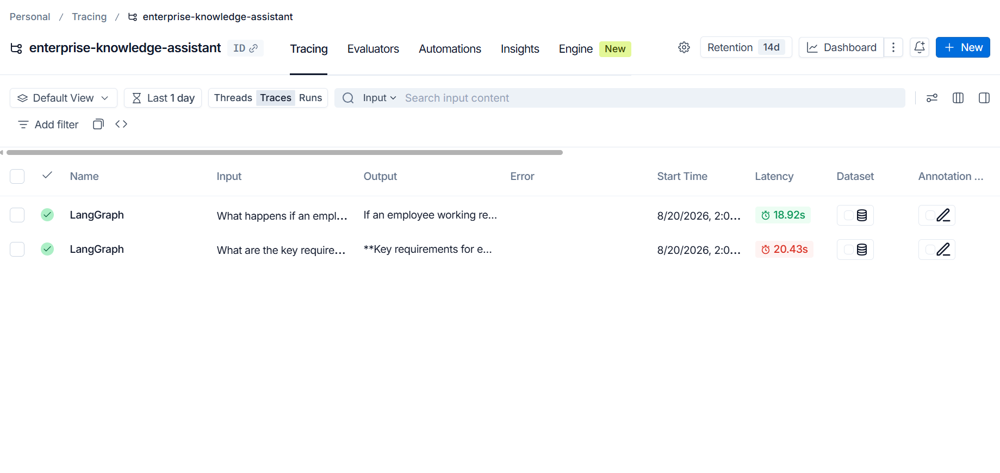
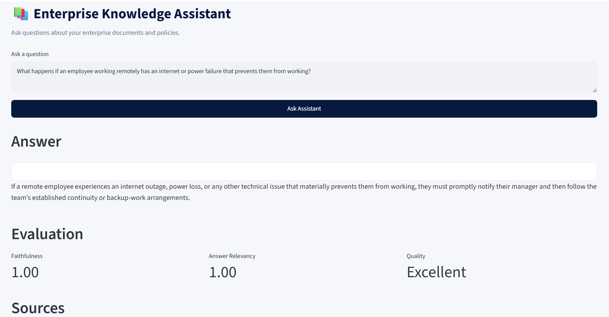
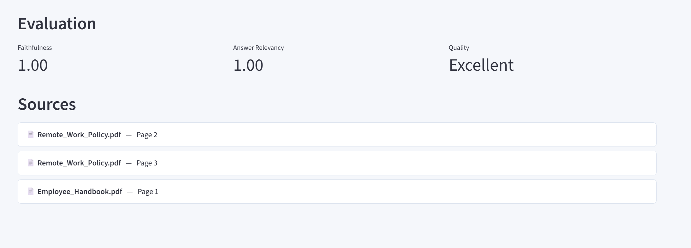
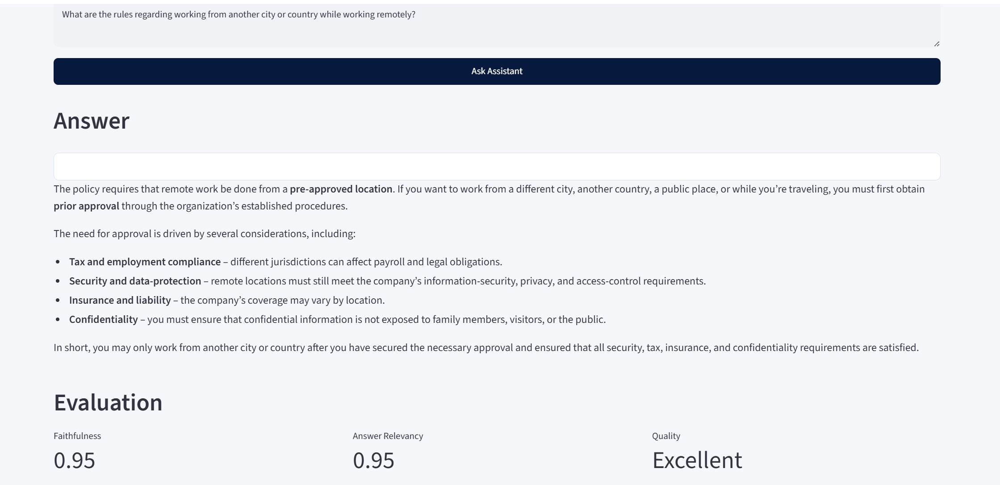
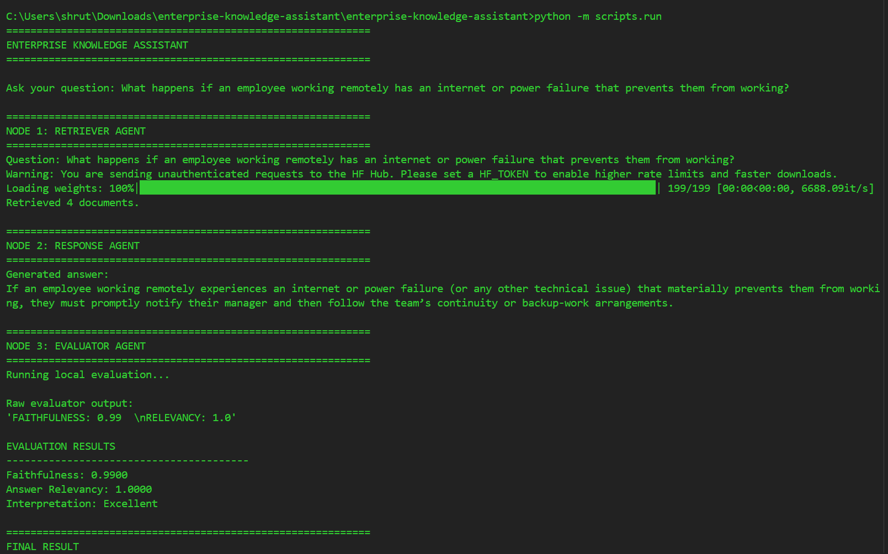

# Enterprise Knowledge Assistant

An Agentic AI-powered Enterprise Knowledge Assistant that uses **Retrieval-Augmented Generation (RAG)** to answer questions from enterprise documents.

The project combines **LangGraph** for agent orchestration, **ChromaDB** for vector search, **HuggingFace Embeddings** for semantic retrieval, **Ollama** for LLM inference, **RAGAS** for response evaluation, **MCP** for tool-based enterprise knowledge access, and **LangSmith** for observability and tracing.

---

## Table of Contents

- [Project Overview](#project-overview)
- [Key Features](#key-features)
- [Architecture Overview](#architecture-overview)
- [Technology Stack](#technology-stack)
- [Project Structure](#project-structure)
- [RAG Design](#rag-design)
- [LangGraph Design](#langgraph-design)
- [MCP Integration](#mcp-integration)
- [RAGAS Evaluation](#ragas-evaluation)
- [Observability](#observability)
- [Setup Instructions](#setup-instructions)
- [Configuration](#configuration)
- [Document Ingestion](#document-ingestion)
- [Execution](#execution)
- [Sample Input](#sample-input)
- [Expected Output](#expected-output)
- [Evidence and Screenshots](#evidence-and-screenshots)
- [Testing](#testing)
- [Project Outcome](#project-outcome)

---

# Project Overview

The Enterprise Knowledge Assistant is designed to answer questions using information contained in enterprise documents.

Instead of relying only on the LLM's pretrained knowledge, the system follows a Retrieval-Augmented Generation approach:

1. The user asks a question.
2. Relevant information is retrieved from enterprise documents.
3. The retrieved context is provided to the LLM.
4. The LLM generates a grounded response.
5. The response is evaluated using RAGAS.
6. The complete workflow is observable through LangSmith.

Example enterprise documents include:

- `Remote_Work_Policy.pdf`
- `Employee_Handbook.pdf`

The application is implemented as a LangGraph workflow consisting of three primary agents:

```text
User Question
      |
      v
Retriever Agent
      |
      v
Response Agent
      |
      v
Evaluator Agent
      |
      v
Final Answer
```

---

# Key Features

- Enterprise document question answering
- Retrieval-Augmented Generation (RAG)
- LangGraph-based agent orchestration
- Semantic document retrieval
- ChromaDB vector database
- HuggingFace embedding model
- Ollama-based LLM inference
- RAGAS evaluation
- Faithfulness evaluation
- Answer Relevancy evaluation
- MCP server integration
- MCP knowledge retrieval tools
- LangSmith observability
- LangGraph node-by-node execution tracing
- Source attribution
- Modular Python architecture

---

# Architecture Overview

```text
                           +----------------+
                           |      USER      |
                           +-------+--------+
                                   |
                                   v
                        +----------------------+
                        |      LangGraph       |
                        |     Orchestrator     |
                        +----------+-----------+
                                   |
                                   v
                        +----------------------+
                        |   Retriever Agent    |
                        +----------+-----------+
                                   |
                                   v
                        +----------------------+
                        |      ChromaDB        |
                        |    Vector Search     |
                        +----------+-----------+
                                   |
                                   v
                        +----------------------+
                        |    Response Agent    |
                        +----------+-----------+
                                   |
                                   v
                        +----------------------+
                        |     Ollama LLM       |
                        +----------+-----------+
                                   |
                                   v
                        +----------------------+
                        |   Evaluator Agent    |
                        +----------+-----------+
                                   |
                                   v
                        +----------------------+
                        |       RAGAS          |
                        |     Evaluation       |
                        +----------+-----------+
                                   |
                                   v
                        +----------------------+
                        |     Final Answer     |
                        +----------------------+

             +------------------+     +------------------+
             |    MCP Server    |     |    LangSmith     |
             | Knowledge Tools  |     |  Observability   |
             +------------------+     +------------------+
```

---

# Technology Stack

| Technology | Purpose |
|---|---|
| Python | Core application development |
| LangChain | LLM and RAG components |
| LangGraph | Agent workflow orchestration |
| ChromaDB | Vector database |
| HuggingFace | Text embeddings |
| Ollama | LLM inference |
| RAGAS | RAG evaluation |
| MCP | Model Context Protocol integration |
| LangSmith | Observability and tracing |
| PyPDF | PDF document processing |
| Python-dotenv | Environment configuration |

---

# Project Structure

```text
enterprise-knowledge-assistant/
│
├── data/
│   └── documents/
│       ├── Remote_Work_Policy.pdf
│       └── Employee_Handbook.pdf
│
├── screenshots/
│   ├── EKA1_langsmith_tracing.png
│   ├── EKA2_application_startup.png
│   ├── EKA3_ragas_results.png
│   ├── EKA4_final_output.png
│   └── EKA5_graph_execution.png
│
├── src/
│   ├── agents/
│   │   ├── retriever_agent.py
│   │   ├── response_agent.py
│   │   └── evaluator_agent.py
│   │
│   ├── rag/
│   │   ├── loader.py
│   │   ├── embeddings.py
│   │   ├── vectorstore.py
│   │   └── retriever.py
│   │
│   ├── graph.py
│   └── state.py
│
├── scripts/
│   ├── ingest.py
│   └── run.py
│
├── mcp_server/
│   └── server.py
│
├── .env
├── .gitignore
├── requirements.txt
└── README.md
```

---

# RAG Design

The project uses Retrieval-Augmented Generation to ground LLM responses in enterprise documents.

```text
Enterprise PDF Documents
          |
          v
    Document Loading
          |
          v
      Chunking
          |
          v
  Embedding Generation
          |
          v
       ChromaDB
          |
          v
   Semantic Retrieval
          |
          v
 Relevant Document Chunks
          |
          v
       Ollama LLM
          |
          v
     Final Answer
```

## Document Source

The knowledge base contains enterprise PDF documents such as:

```text
Remote_Work_Policy.pdf
Employee_Handbook.pdf
```

These documents contain organizational policies and employee-related information used by the assistant to answer user queries.

## Document Loading

PDF files are loaded and their text is extracted using `pypdf`.

The ingestion pipeline processes the documents page by page before preparing them for retrieval.

Example ingestion output:

```text
============================================================
ENTERPRISE KNOWLEDGE ASSISTANT - INGESTION
============================================================

Loaded 11 pages.
Created 39 chunks.
```

## Chunking Strategy

The extracted document text is split into smaller overlapping chunks using a recursive text splitter.

Chunking allows the retriever to search relevant sections instead of passing complete documents to the LLM.

This helps to:

- Improve retrieval precision
- Reduce unnecessary context
- Keep prompts manageable
- Preserve meaningful sections of documents

## Embedding Model

The project uses **HuggingFace Embeddings** to convert document chunks into vector representations.

The same embedding configuration is used during retrieval so that the user's question can be compared semantically with the stored document chunks.

Embeddings are generated locally.

## Vector Database

**ChromaDB** is used as the vector database.

The document chunks and their embeddings are stored in ChromaDB.

When the user asks a question:

```text
User Question
      |
      v
Question Embedding
      |
      v
ChromaDB Similarity Search
      |
      v
Relevant Document Chunks
```

The retrieved chunks are then passed to the Response Agent.

## Retrieval

The Retriever Agent performs semantic search against the ChromaDB vector store.

For example:

```text
Question:
What are the key requirements for employees working remotely?
```

The retriever can return information related to:

- Approved work locations
- Information security
- Health and safety
- Business continuity
- Availability and punctuality

The retrieved information is passed to the Response Agent as context.

---

# LangGraph Design

LangGraph is used to orchestrate the Agentic AI workflow.

The application contains three main nodes:

```text
START
  |
  v
Retriever Agent
  |
  v
Response Agent
  |
  v
Evaluator Agent
  |
  v
END
```

## Node 1 — Retriever Agent

### Responsibility

The Retriever Agent searches the enterprise knowledge base for relevant information.

### Input

```text
User Question
```

### Processing

```text
Question
   |
   v
Semantic Search
   |
   v
ChromaDB
   |
   v
Relevant Documents
```

### Output

Relevant document chunks and source information.

## Node 2 — Response Agent

### Responsibility

The Response Agent generates the final answer using the retrieved enterprise context.

The agent receives:

- User question
- Retrieved document context

The configured Ollama LLM generates a response grounded in the retrieved information.

## Node 3 — Evaluator Agent

### Responsibility

The Evaluator Agent evaluates the generated response using RAGAS.

The evaluator calculates:

- Faithfulness
- Answer Relevancy

The scores are added to the final application result.

---

# MCP Integration

The project includes a **Model Context Protocol (MCP)** server.

The MCP server exposes enterprise knowledge retrieval as standardized tools.

## MCP Tools

### `search_enterprise_knowledge`

Searches the enterprise knowledge base using a natural-language query.

```text
search_enterprise_knowledge(
    query="What are the key requirements for employees working remotely?"
)
```

### `get_document_sources`

Returns source/document information associated with the enterprise knowledge base.

## Running the MCP Server

From the project root:

```bash
python -m mcp_server.server
```

The available tools can be verified using:

```bash
python -c "import asyncio; from mcp_server.server import mcp; tools=asyncio.run(mcp.list_tools()); print([t.name for t in tools])"
```

Expected output:

```text
['search_enterprise_knowledge', 'get_document_sources']
```

---

# RAGAS Evaluation

RAGAS is used to evaluate the quality of generated responses.

## Metrics Collected

### Faithfulness

Measures whether the generated answer is supported by the retrieved context.

### Answer Relevancy

Measures how relevant the generated response is to the user's question.

## Evaluation Flow

```text
Retrieved Context
        |
        v
Generated Answer
        |
        +--------------------+
        |                    |
        v                    v
Faithfulness          Answer Relevancy
        |                    |
        +---------+----------+
                  |
                  v
           RAGAS Evaluation
                  |
                  v
          Evaluation Results
```

## Evaluation Results

Example result obtained from the application:

```text
RAGAS SCORES
----------------------------------------
Faithfulness: 1.0000
Answer Relevancy: 1.0000
Interpretation: Excellent
```

| Metric | Score | Interpretation |
|---|---:|---|
| Faithfulness | 1.0000 | Excellent grounding in retrieved context |
| Answer Relevancy | 1.0000 | Highly relevant to the user question |

Scores can vary depending on the question, retrieved context, LLM response, and evaluation conditions.

---

# Observability

LangSmith is integrated into the application to provide observability into the Agentic AI workflow.

LangSmith can be used to inspect:

- LangGraph execution
- Individual node executions
- LLM calls
- Inputs and outputs
- Execution latency
- Errors
- Workflow behavior

Example configuration:

```text
LANGSMITH_TRACING=true
LANGSMITH_API_KEY=<your-langsmith-api-key>
LANGSMITH_PROJECT=enterprise-knowledge-assistant
```

The API key is stored in `.env` and should not be committed to source control.

---

# Setup Instructions

## Prerequisites

- Python 3.10 or higher
- Ollama
- Git
- Required Python dependencies

## Create a Virtual Environment

Windows:

```bash
python -m venv venv
venv\Scriptsctivate
```

Linux/macOS:

```bash
source venv/bin/activate
```

## Install Dependencies

```bash
python -m pip install -r requirements.txt
```

## Configure Environment Variables

Create `.env` in the project root:

```text
OLLAMA_BASE_URL=http://localhost:11434
LLM_MODEL=gpt-oss:120b-cloud

LANGSMITH_TRACING=true
LANGSMITH_API_KEY=<your-langsmith-api-key>
LANGSMITH_PROJECT=enterprise-knowledge-assistant
```

Do not commit `.env` to GitHub.

---

# Configuration

| Variable | Purpose |
|---|---|
| `OLLAMA_BASE_URL` | Ollama server URL |
| `LLM_MODEL` | LLM used for response generation |
| `LANGSMITH_TRACING` | Enables LangSmith tracing |
| `LANGSMITH_API_KEY` | LangSmith authentication |
| `LANGSMITH_PROJECT` | LangSmith project name |

---

# Document Ingestion

Place enterprise PDF documents inside:

```text
data/
└── documents/
    ├── Remote_Work_Policy.pdf
    └── Employee_Handbook.pdf
```

Run:

```bash
python -m scripts.ingest
```

Example output:

```text
============================================================
ENTERPRISE KNOWLEDGE ASSISTANT - INGESTION
============================================================

Loaded 11 pages.
Created 39 chunks.
```

The documents are:

1. Loaded
2. Split into chunks
3. Converted into embeddings
4. Stored in ChromaDB

---

# Execution

After document ingestion:

```bash
python -m scripts.run
```

The application displays:

```text
============================================================
ENTERPRISE KNOWLEDGE ASSISTANT
============================================================

Ask your question:
```

Enter a natural-language question.

---

# Sample Input

```text
What are the key requirements for employees working remotely?
```

Other useful questions:

```text
What is the remote work policy?

What are the rules regarding working from another city or country?

What happens if an employee has an internet or power failure while working remotely?

What information security requirements apply to remote workers?
```

---

# Expected Output

A typical execution follows:

```text
============================================================
NODE 1: RETRIEVER AGENT
============================================================

Question:
What are the key requirements for employees working remotely?

Retrieved documents.

============================================================
NODE 2: RESPONSE AGENT
============================================================

Generated answer:
The key requirements for employees working remotely include
approved work locations, information security, health and
safety practices, business continuity, and maintaining
availability during required working hours.

============================================================
NODE 3: EVALUATOR AGENT
============================================================

Running RAGAS evaluation...

RAGAS SCORES
----------------------------------------
Faithfulness: 1.0000
Answer Relevancy: 1.0000
Interpretation: Excellent

============================================================
FINAL RESULT
============================================================

QUESTION:
What are the key requirements for employees working remotely?

ANSWER:
The key requirements for employees working remotely include
approved work locations, information security, health and
safety practices, business continuity, and maintaining
availability during required working hours.

SOURCES:
- Remote_Work_Policy.pdf
- Employee_Handbook.pdf
```

The exact generated answer and evaluation scores may vary.

---

# Evidence and Screenshots

Place the screenshot files inside the `screenshots/` directory using these filenames.

## Img EKA1 — Observability: LangSmith Tracing



**Img EKA1 — LangSmith Observability and Tracing**

## Img EKA2 — Application Startup



**Img EKA2 — Application Startup**

## Img EKA3 — RAGAS Evaluation Results



**Img EKA3 — RAGAS Evaluation Results**

## Img EKA4 — Final Output Generated by the Application



**Img EKA4 — Final Application Output**

## Img EKA5 — Graph Execution Trace

The LangGraph workflow executes:

```text
NODE 1: RETRIEVER AGENT
        |
        v
NODE 2: RESPONSE AGENT
        |
        v
NODE 3: EVALUATOR AGENT
```



**Img EKA5 — LangGraph Node-by-Node Execution**

---

# Testing

Recommended test questions:

```text
1. What is the remote work policy?

2. What are the key requirements for employees working remotely?

3. What are the rules regarding working from another city or country?

4. What happens if an employee has an internet or power failure while working remotely?

5. What information security requirements apply to remote workers?
```

For every query:

```text
Question
   |
   v
Document Retrieval
   |
   v
Answer Generation
   |
   v
RAGAS Evaluation
   |
   v
Final Response
```

---

# End-to-End Workflow

```text
                         USER QUESTION
                               |
                               v
                     +-------------------+
                     |   Retriever Agent |
                     +---------+---------+
                               |
                               v
                     +-------------------+
                     |     ChromaDB      |
                     |   Vector Search   |
                     +---------+---------+
                               |
                               v
                     +-------------------+
                     |   Response Agent  |
                     +---------+---------+
                               |
                               v
                     +-------------------+
                     |    Ollama LLM     |
                     +---------+---------+
                               |
                               v
                     +-------------------+
                     |  Evaluator Agent  |
                     +---------+---------+
                               |
                               v
                     +-------------------+
                     |       RAGAS       |
                     +---------+---------+
                               |
                               v
                         FINAL ANSWER

       +--------------------+       +--------------------+
       |     MCP Server     |       |     LangSmith      |
       | Enterprise Tools   |       |   Observability    |
       +--------------------+       +--------------------+
```

---

# Project Outcome

The Enterprise Knowledge Assistant demonstrates an end-to-end Agentic AI application combining retrieval, generation, evaluation, tool integration, workflow orchestration, and observability.

The system is capable of:

1. Loading enterprise PDF documents.
2. Splitting documents into meaningful chunks.
3. Generating semantic embeddings.
4. Storing embeddings in ChromaDB.
5. Retrieving relevant enterprise knowledge.
6. Generating grounded responses using an LLM.
7. Orchestrating multiple agents using LangGraph.
8. Evaluating responses using RAGAS.
9. Exposing enterprise knowledge through MCP tools.
10. Providing source information for retrieved content.
11. Providing node-by-node execution visibility.
12. Monitoring the application using LangSmith.

---

# Conclusion

This project demonstrates how modern Agentic AI components can be integrated to build an enterprise-focused knowledge assistant.

```text
RAG
+
LangGraph
+
LLM
+
ChromaDB
+
HuggingFace Embeddings
+
RAGAS
+
MCP
+
LangSmith
=
Enterprise Knowledge Assistant
```

The resulting system provides a complete workflow for enterprise question answering with **retrieval, grounded generation, automated evaluation, MCP-based tool access, and end-to-end observability**.
