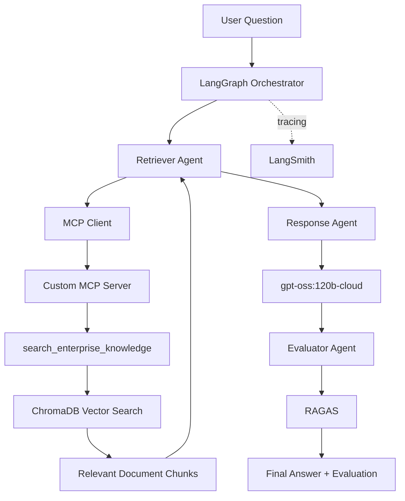
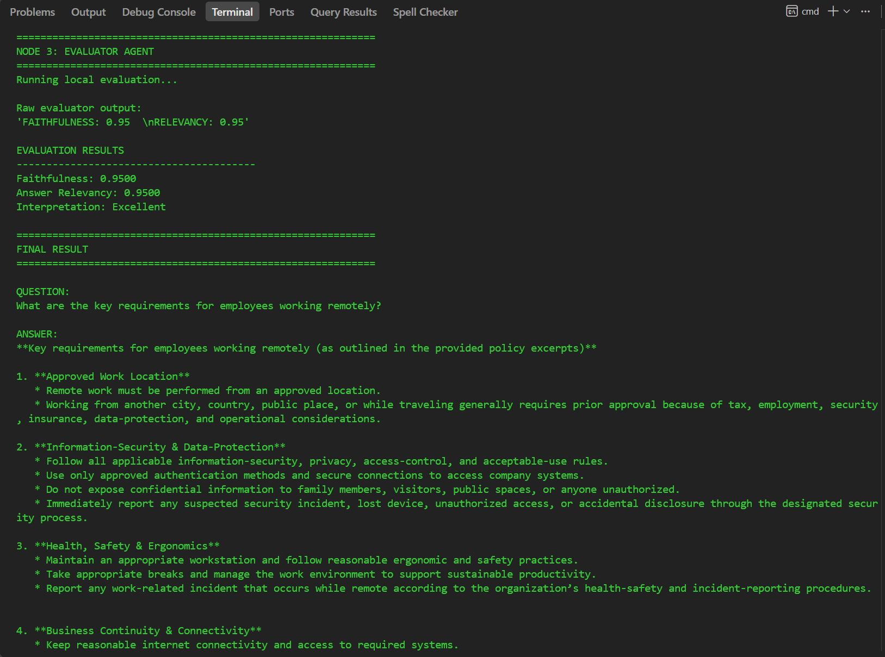
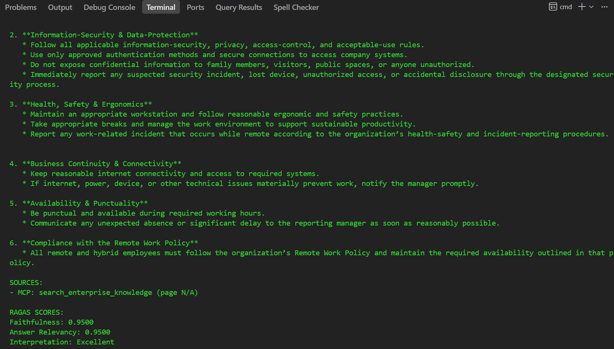

# Enterprise Knowledge Assistant

An **Agentic AI Enterprise Knowledge Assistant** that answers questions
from enterprise policy documents using **RAG, LangGraph, MCP, RAGAS,
Ollama, and LangSmith**.

The system retrieves relevant information from enterprise PDFs, uses a
LangGraph workflow to generate a grounded response, evaluates the
response using RAGAS, and provides observability through LangSmith.

------------------------------------------------------------------------

## 1. Project Overview

The Enterprise Knowledge Assistant is designed to answer
natural-language questions using information contained in enterprise
documents.

Instead of relying only on the LLM's pretrained knowledge, the
application follows a Retrieval-Augmented Generation workflow:

1.  Enterprise PDF documents are loaded.
2.  Documents are split into smaller chunks.
3.  Chunks are converted into embeddings.
4.  Embeddings are stored in ChromaDB.
5.  A user question is semantically matched against the knowledge base.
6.  The LangGraph Retriever Agent obtains the relevant context through
    the MCP integration.
7.  The Response Agent generates an answer grounded in the retrieved
    context.
8.  The Evaluator Agent evaluates the generated answer using RAGAS.
9.  LangSmith provides end-to-end tracing and observability.

### Knowledge Sources

The project uses enterprise documents such as:

-   `Remote_Work_Policy.pdf`
-   `Employee_Handbook.pdf`

------------------------------------------------------------------------

## 2. Key Features

-   Enterprise document question answering
-   Retrieval-Augmented Generation (RAG)
-   Semantic search over enterprise documents
-   ChromaDB vector database
-   HuggingFace embeddings
-   LangGraph agent orchestration
-   Custom MCP server
-   MCP tool-based enterprise knowledge retrieval
-   Active MCP usage by the LangGraph Retriever Agent
-   Ollama LLM inference
-   `gpt-oss:120b-cloud` for response generation
-   RAGAS evaluation
-   Faithfulness evaluation
-   Answer Relevancy evaluation
-   LangSmith tracing and observability
-   Node-by-node LangGraph execution visibility
-   Source attribution
-   Modular Python architecture

------------------------------------------------------------------------

## 3. Architecture Overview



### High-Level Flow

``` text
User Question
      |
      v
LangGraph
      |
      v
Retriever Agent
      |
      v
MCP Client
      |
      v
MCP Server
      |
      v
search_enterprise_knowledge
      |
      v
ChromaDB
      |
      v
Retrieved Context
      |
      v
Response Agent
      |
      v
gpt-oss:120b-cloud
      |
      v
Evaluator Agent
      |
      v
RAGAS
      |
      v
Final Answer
```

------------------------------------------------------------------------

## 4. Technology Stack

  Technology             Purpose
  ---------------------- ------------------------------
  Python                 Core application
  LangChain              LLM and RAG components
  LangGraph              Agent workflow orchestration
  ChromaDB               Vector database
  HuggingFace            Document embeddings
  Ollama                 LLM inference interface
  `gpt-oss:120b-cloud`   Response generation
  `qwen3:4b`             Evaluation model
  RAGAS                  RAG evaluation
  MCP                    Tool-based knowledge access
  LangSmith              Observability and tracing
  PyPDF                  PDF document loading
  python-dotenv          Environment configuration

------------------------------------------------------------------------

## 5. Project Structure

``` text
enterprise-knowledge-assistant/
│
├── data/
│   ├── Remote_Work_Policy.pdf
│   └── Employee_Handbook.pdf
│
├── chroma_db/
│
├── mcp_server/
│   └── server.py
│
├── src/
│   ├── agents/
│   │   ├── retriever_agent.py
│   │   ├── response_agent.py
│   │   └── evaluator_agent.py
│   │
│   ├── rag/
│   │   ├── loader.py
│   │   ├── embeddings.py
│   │   ├── vectorstore.py
│   │   └── retriever.py
│   │
│   ├── graph.py
│   ├── state.py
│   └── config.py
│
├── scripts/
│   ├── ingest.py
│   └── run.py
│
├── screenshots/
│   ├── EKA1.png
│   ├── EKA2.png
│   ├── EKA3.png
│   ├── EKA4.png
│   ├── EKA5.png
│   ├── EKA6.png
│   └── EKA7.png
│
├── .env
├── .gitignore
├── requirements.txt
└── README.md
```

> Keep `.env` out of source control. API keys and secrets must never be
> committed to GitHub.

------------------------------------------------------------------------

# 6. RAG Design

## 6.1 Document Source

The knowledge base contains enterprise PDF documents:

``` text
Remote_Work_Policy.pdf
Employee_Handbook.pdf
Leave_Policy.pdf
```

The PDFs are loaded using `pypdf`.

Each page is processed with source and page metadata so retrieved
information can be associated with its originating document.

------------------------------------------------------------------------

## 6.2 Document Loading

The ingestion pipeline is:

``` text
PDF Documents
      |
      v
PyPDF
      |
      v
Page-level Text Extraction
      |
      v
Source + Page Metadata
```

The loader extracts text page by page and stores:

-   document text
-   source filename
-   page number

------------------------------------------------------------------------

## 6.3 Chunking Strategy

The project uses `RecursiveCharacterTextSplitter`.

Current configuration:

``` text
chunk_size    = 800
chunk_overlap = 120
```

The overlap helps preserve context between neighboring chunks.

Chunking helps to:

-   improve retrieval precision
-   reduce unnecessary context
-   keep prompts manageable
-   preserve meaningful policy sections

------------------------------------------------------------------------

## 6.4 Embedding Model

The project uses:

``` text
BAAI/bge-small-en-v1.5
```

through `HuggingFaceEmbeddings`.

Embeddings are generated locally using CPU configuration and normalized
before similarity search.

------------------------------------------------------------------------

## 6.5 Vector Database

The project uses:

``` text
ChromaDB
```

Collection:

``` text
enterprise_knowledge
```

Persisted vector database:

``` text
./chroma_db
```

------------------------------------------------------------------------

## 6.6 Retrieval

The Retriever performs semantic similarity search against ChromaDB.

The current default retrieval count is:

``` text
TOP_K = 4
```

The retrieved chunks are passed to the Response Agent as context.

------------------------------------------------------------------------

# 7. LangGraph Design

LangGraph orchestrates the Agentic AI workflow.

### Graph

``` text
START
  |
  v
Retriever Agent
  |
  v
Response Agent
  |
  v
Evaluator Agent
  |
  v
END
```

## 7.1 Node 1 --- Retriever Agent

### Responsibility

Retrieves relevant enterprise knowledge for the user's question.

### Processing

``` text
Question
   |
   v
MCP Client
   |
   v
MCP Server
   |
   v
search_enterprise_knowledge
   |
   v
RAG / ChromaDB
   |
   v
Relevant Context
```

### Output

-   Retrieved context
-   Source information

The Retriever Agent actively calls the MCP tool during normal LangGraph
execution.

------------------------------------------------------------------------

## 7.2 Node 2 --- Response Agent

### Responsibility

Generates the final answer using the user question and retrieved
enterprise context.

### Model

``` text
gpt-oss:120b-cloud
```

### Input

-   User question
-   Retrieved context

### Output

A grounded natural-language response.

------------------------------------------------------------------------

## 7.3 Node 3 --- Evaluator Agent

### Responsibility

Evaluates the generated answer.

### Metrics

-   Faithfulness
-   Answer Relevancy

The scores and interpretation are added to the final application result.

------------------------------------------------------------------------

# 8. MCP Integration

The project includes a **custom MCP server** for enterprise knowledge
retrieval.

## MCP Server

``` text
mcp_server/server.py
```

The MCP server is implemented using the MCP Python SDK.

## MCP Tools

### `search_enterprise_knowledge`

Searches the enterprise knowledge base using a natural-language query.

Example:

``` text
search_enterprise_knowledge(
    query="What are the key requirements for employees working remotely?"
)
```

### `get_document_sources`

Returns available enterprise document sources.

------------------------------------------------------------------------

## 8.1 Active MCP Usage by LangGraph

This is a key project requirement.

The MCP integration is **actively used during normal LangGraph
execution**. It is not only a standalone server.

The execution flow is:

``` text
LangGraph Retriever Agent
          |
          v
      MCP Client
          |
          v
      MCP Server
          |
          v
search_enterprise_knowledge
          |
          v
       RAG Search
          |
          v
 Retrieved Context
```

The application output explicitly confirms the invocation:

``` text
NODE 1: RETRIEVER AGENT

Calling MCP tool: search_enterprise_knowledge
MCP retrieval completed.
```

This demonstrates that a LangGraph node actively uses the MCP
integration during execution.

------------------------------------------------------------------------

## 8.2 Verify MCP Tools

From the project root:

``` cmd
python -c "import asyncio; from mcp_server.server import mcp; tools=asyncio.run(mcp.list_tools()); print([t.name for t in tools])"
```

Expected:

``` text
['search_enterprise_knowledge', 'get_document_sources']
```

------------------------------------------------------------------------

# 9. RAGAS Evaluation

RAGAS evaluates the quality of the generated response.

## Metrics Collected

### Faithfulness

Measures whether the generated answer is supported by the retrieved
context.

### Answer Relevancy

Measures whether the generated response addresses the user's question.

## Evaluation Flow

``` text
Retrieved Context
       |
       v
Generated Answer
       |
       +----------------------+
       |                      |
       v                      v
Faithfulness          Answer Relevancy
       |                      |
       +----------+-----------+
                  |
                  v
             RAGAS Result
```

## Example Evaluation

A recent successful application execution produced:

``` text
Faithfulness: 0.9500
Answer Relevancy: 0.9500
Interpretation: Excellent
```

Scores can vary depending on the question, retrieved context, generated
response, evaluation model, and evaluation conditions.

------------------------------------------------------------------------

# 10. LangSmith Observability

LangSmith provides observability into the Agentic AI workflow.

It allows inspection of:

-   LangGraph execution
-   Individual graph nodes
-   LLM calls
-   Inputs and outputs
-   Execution latency
-   Evaluation results
-   Workflow behavior

Example configuration:

``` env
LANGSMITH_TRACING=true
LANGSMITH_API_KEY=<your-langsmith-api-key>
LANGSMITH_PROJECT=enterprise-knowledge-assistant
```

Do not commit the API key to GitHub.

------------------------------------------------------------------------

# 11. Setup Instructions

## Prerequisites

-   Python 3.10+
-   Ollama
-   Git

## Create Virtual Environment

### Windows

``` cmd
python -m venv venv
venv\Scripts\activate
```

### Linux/macOS

``` bash
python3 -m venv venv
source venv/bin/activate
```

## Install Dependencies

``` cmd
python -m pip install -r requirements.txt
```

## Configure Environment

Create `.env` in the project root:

``` env
OLLAMA_BASE_URL=http://localhost:11434

LLM_MODEL=gpt-oss:120b-cloud
EVALUATOR_MODEL=qwen3:4b

EMBEDDING_MODEL=BAAI/bge-small-en-v1.5

VECTOR_DB_PATH=./chroma_db
COLLECTION_NAME=enterprise_knowledge
TOP_K=4

LANGSMITH_TRACING=true
LANGSMITH_API_KEY=<your-langsmith-api-key>
LANGSMITH_PROJECT=enterprise-knowledge-assistant
```

------------------------------------------------------------------------

# 12. Document Ingestion

Place the enterprise PDFs inside:

``` text
data/
├── Remote_Work_Policy.pdf
└── Employee_Handbook.pdf
```

Run:

``` cmd
python -m scripts.ingest
```

The ingestion pipeline is:

``` text
PDF
 |
 v
Text Extraction
 |
 v
Chunking
 |
 v
Embedding Generation
 |
 v
ChromaDB
```

------------------------------------------------------------------------

# 13. Run the Application

After ingestion:

``` cmd
python -m scripts.run
```

You will see:

``` text
============================================================
ENTERPRISE KNOWLEDGE ASSISTANT
============================================================

Ask your question:
```

Enter a natural-language question.

------------------------------------------------------------------------

# 14. Sample Questions

``` text
What are the key requirements for employees working remotely?
```

``` text
What is the remote work policy?
```

``` text
What are the rules regarding working from another city or country?
```

``` text
What information security requirements apply to remote workers?
```

``` text
What should an employee do if internet or power issues prevent them from working remotely?
```

------------------------------------------------------------------------

# 15. Expected Execution

A successful run follows this sequence:

``` text
============================================================
NODE 1: RETRIEVER AGENT
============================================================

Calling MCP tool: search_enterprise_knowledge
MCP retrieval completed.

============================================================
NODE 2: RESPONSE AGENT
============================================================

Generated answer:
...

============================================================
NODE 3: EVALUATOR AGENT
============================================================

Running local evaluation...

EVALUATION RESULTS
----------------------------------------
Faithfulness: 0.9500
Answer Relevancy: 0.9500
Interpretation: Excellent
```

The final result contains:

-   Question
-   Generated answer
-   Sources
-   RAGAS scores
-   Evaluation interpretation

------------------------------------------------------------------------

# 16. Evidence and Screenshots

Place all screenshots inside the `screenshots/` directory.

## EKA1 --- LangSmith Observability

Shows LangSmith tracing and observability of the LangGraph workflow.


## EKA2 --- Application Startup

Shows application startup and the user question.


## EKA3 --- RAGAS Evaluation Results

Shows RAGAS evaluation results.


## EKA4 --- Final Application Output

Shows the final answer generated by the application.


## EKA5 --- MCP Tool Invocation

Shows the Retriever Agent invoking:

``` text
Calling MCP tool: search_enterprise_knowledge
MCP retrieval completed.
```

This is direct evidence that MCP is actively used during graph
execution.


## EKA6 --- RAGAS Evaluation and Final Result

Shows the Evaluator Agent, Faithfulness, Answer Relevancy,
interpretation, and generated result.



## EKA7 --- Final Output, Sources and RAGAS

Shows the final answer, MCP source information, and RAGAS scores.



------------------------------------------------------------------------

## 17. Requirement Compliance

The project satisfies the specified Enterprise Knowledge Assistant requirements across RAG, LangGraph, MCP, evaluation, observability, and final response generation.

| Requirement | Status | Implementation |
|---|---|---|
| Enterprise Knowledge Source | **Satisfied** | Enterprise PDF documents are loaded with PyPDF, including `Remote_Work_Policy.pdf` and `Employee_Handbook.pdf`, with source and page metadata retained. |
| RAG Implementation | **Satisfied** | Documents are chunked using recursive text splitting (`chunk_size=800`, `chunk_overlap=120`), embedded with `BAAI/bge-small-en-v1.5`, stored in ChromaDB, retrieved through semantic search, and passed to the LLM for grounded response generation. |
| LangGraph | **Satisfied** | A `StateGraph` orchestrates the `Retriever Agent → Response Agent → Evaluator Agent` workflow using shared state. |
| MCP Integration | **Satisfied** | A custom MCP server exposes `search_enterprise_knowledge` and `get_document_sources`. The LangGraph Retriever Agent actively calls the MCP tool during execution to retrieve enterprise knowledge. |
| RAGAS Evaluation | **Satisfied** | The Evaluator Agent calculates Faithfulness and Answer Relevancy and displays the evaluation results and interpretation. Example result: **0.95 Faithfulness, 0.95 Answer Relevancy — Excellent**. |
| Observability | **Satisfied** | LangSmith tracing provides visibility into LangGraph execution, individual nodes, LLM calls, inputs, outputs, latency, retrieved context, and evaluation results. |
| Graph Execution Trace | **Satisfied** | Node-by-node execution is captured for the Retriever Agent, Response Agent, and Evaluator Agent in both application output and LangSmith. |
| Final Application Output | **Satisfied** | The application produces a grounded final answer containing the user question, generated response, source information, RAGAS scores, and evaluation interpretation. |

### Overall Status

**All specified project requirements are implemented and satisfied.**

The complete workflow is:

`Enterprise PDFs → RAG Retrieval → MCP Tool → LangGraph Agents → LLM Response → RAGAS Evaluation → LangSmith Observability → Final Output`

